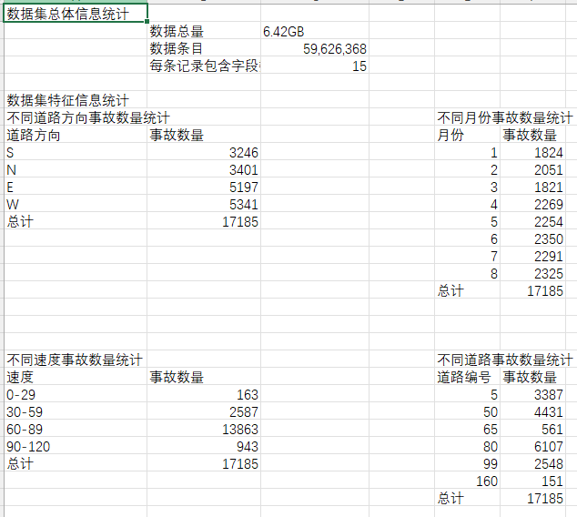
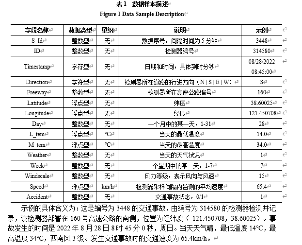
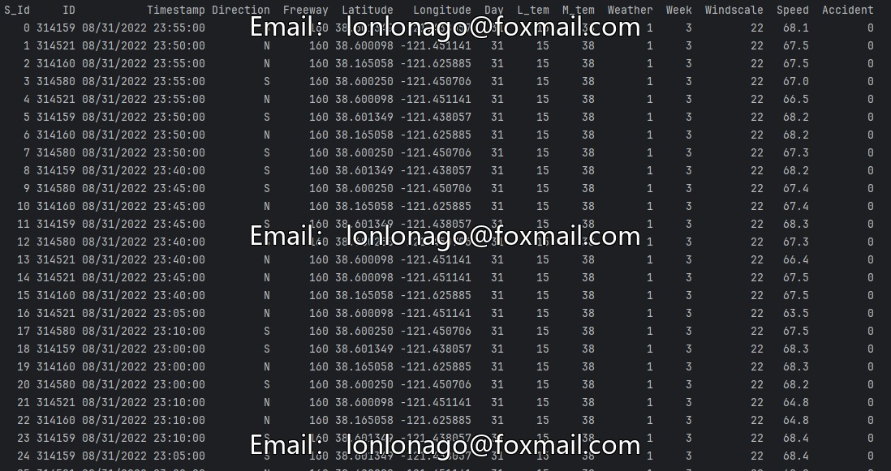

## Body

2022-1-8, United States High-Speed Traffic Accident Data Set

The dataset includes one data file with a total of 59,626,368 records. Each record includes highway number, detector number, direction of travel, longitude, latitude, speed, accident, weather condition, temperature, wind force level, etc.

Source article:

Please refer to the product image for statistical fields.

## Images

item_1061052377490

Here is a pay link on Stripe ( https://buy.stripe.com/3cs8yP7sY87d0vu9AB ). Please contact me lonlonago@foxmail.com after funding $89, and I will send you a complete data files , thank you!

